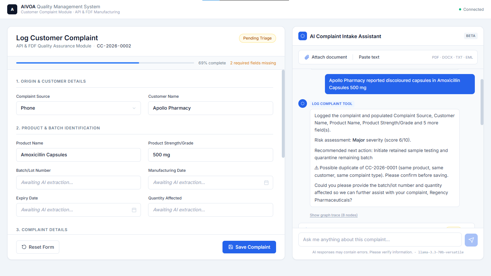
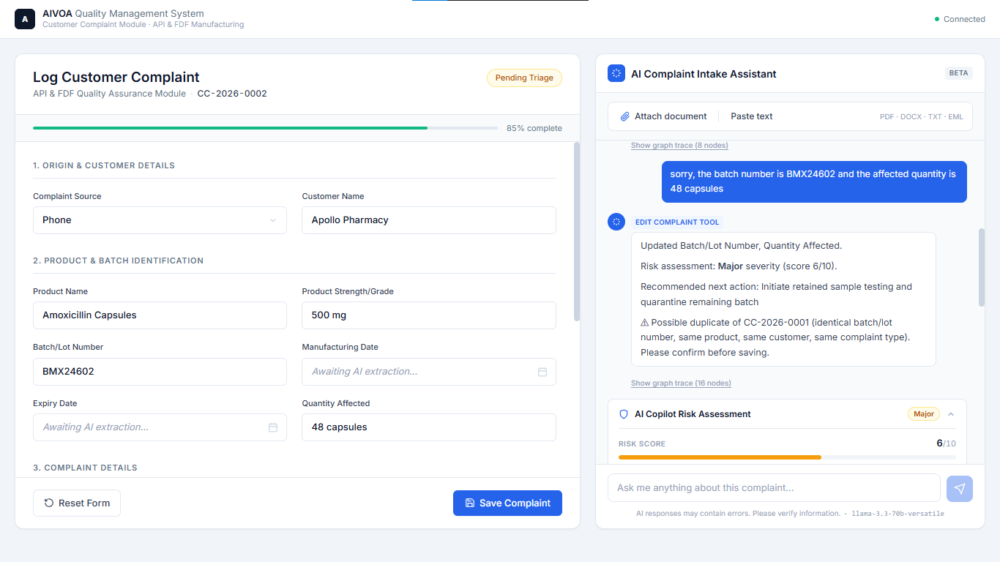
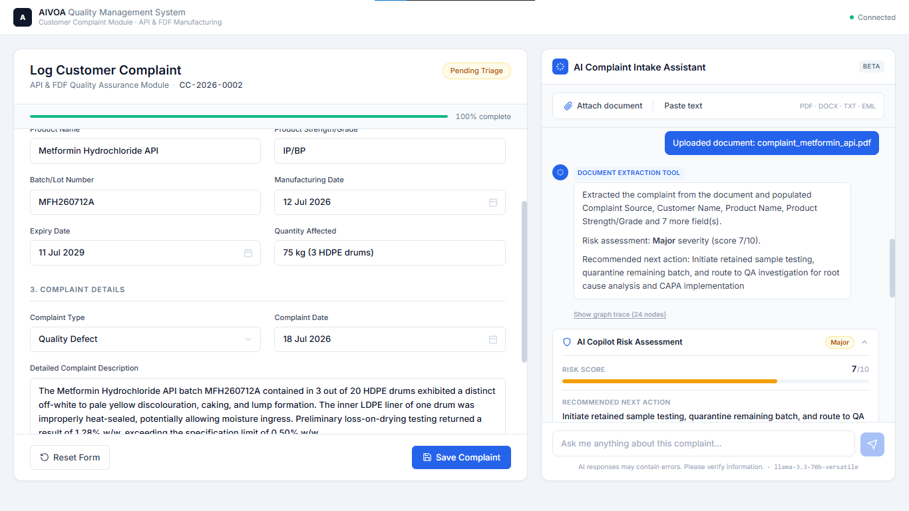
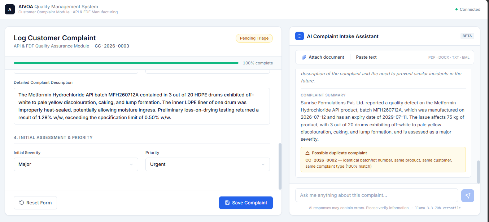

# AI-Powered Customer Complaint Management System

**An AI intake assistant for pharmaceutical Quality Management Systems.** Describe a
complaint in plain English — or drop in a PDF — and a LangGraph agent extracts every
field, classifies the risk, and recommends corrective action.

The complaint form is never filled by hand. Every field on it is written by the AI, from
a typed prompt, a natural-language correction, or an uploaded document — and every
change re-derives the risk assessment beside it.

Built for the AIVOA.AI Round 1 technical assignment.


---

## Screenshots

**Type a complaint, and thirteen fields populate themselves.**



*"Apollo Pharmacy reported discoloured capsules in Amoxicillin Capsules 500 mg" — the
agent extracts the customer, product, strength and defect type, writes the description,
classifies severity against GMP criteria, and produces a full risk assessment.*

<br/>

**Correct it in plain English, and nothing else moves.**



*"sorry, the batch number is BMX24602 and the affected quantity is 48 capsules" — two
fields change, the other eleven are untouched, and the risk assessment re-runs against
the complete record. That guarantee is [the core design decision](#the-core-design-decision).*

<br/>

**Or upload the complaint instead.**



*A PDF letter, a Word file or a forwarded email goes down the same path. A bulk API
complaint measured in kilos and drums is handled as well as a retail pharmacy reporting
capsules — and it can still be amended by typing afterwards.*

<br/>

**And it catches what an intake clerk would miss.**



*A second complaint on the same batch is flagged before saving. Three pharmacies
reporting one bad batch is one investigation, not three.*

---

## Tech stack

| Layer | Choice |
|---|---|
| **Frontend** | React 18, Redux Toolkit, Tailwind, Vite |
| **Backend** | Python 3.11, FastAPI, Pydantic v2 |
| **AI orchestration** | LangGraph `StateGraph` + `MemorySaver` checkpointer |
| **LLM** | Groq — `llama-3.3-70b-versatile` (reasoning), `llama-3.1-8b-instant` (extraction) |
| **Database** | PostgreSQL 16, SQLAlchemy 2.0 |
| **Documents** | pypdf, python-docx, stdlib email parser |

<sub>Stack mandated by the assignment brief. UI uses Google Inter throughout, as
specified.</sub>

---

## Architecture

```
┌──────────────────────────────────────────────────────────────────┐
│  React 18 + Redux Toolkit                                        │
│                                                                  │
│  ComplaintForm.jsx          CopilotPanel.jsx                     │
│  read-only projection  ◀──  upload · chat · risk · trace         │
│  of state.form              dispatches sendMessage()             │
└────────────────────────────┬─────────────────────────────────────┘
                             │  POST /api/complaints/{id}/message
                             │  multipart: message? + file?
┌────────────────────────────▼─────────────────────────────────────┐
│  FastAPI                                                         │
│    routers/complaints.py   ← the endpoint that drives everything │
│    services/document.py    ← pypdf / python-docx / email parser  │
│    services/repository.py  ← Postgres row ⇄ graph state          │
└────────────────────────────┬─────────────────────────────────────┘
                             │  graph.invoke(state, thread_id=...)
┌────────────────────────────▼─────────────────────────────────────┐
│  LangGraph StateGraph — 13 nodes                                 │
│    router → tool → assess_risk → bonus chain → reply → persist   │
└────────────────────────────┬─────────────────────────────────────┘
                             │
              ┌──────────────┴──────────────┐
              ▼                             ▼
     ┌─────────────────┐          ┌──────────────────┐
     │  Groq API       │          │  PostgreSQL      │
     │  JSON mode +    │          │  complaints      │
     │  Pydantic       │          │  revisions       │
     │  validation     │          │  chat_turns      │
     └─────────────────┘          └──────────────────┘
```

Postgres is the source of truth between turns. Each request rehydrates graph state from
the row, so a page refresh, a server restart or a second browser tab all see the same
complaint. The `MemorySaver` checkpointer keys on `complaint-{id}` for within-thread
history.

---

## The core design decision

The complaint form has thirteen fields. When someone corrects the batch number, only
that field should change.

The obvious implementation is to send the model the current form and ask for the updated
version back. That works most of the time — but you are asking it to correctly retype
eleven fields nobody mentioned. Eventually it drops one, or rewords the description, or
writes `"unknown"` into an empty field. In a complaint system that matters: the batch
number is the field you would trace a recall through.

So the model never returns a form. It returns a **patch** — only the fields it is
changing:

```python
class ComplaintForm(BaseModel):
    batch_lot_number: Optional[str] = None
    product_name: Optional[str] = None
    # ...eleven more, all Optional, no defaults

    def merge(self, patch: "ComplaintForm") -> "ComplaintForm":
        merged = self.model_dump()
        merged.update(patch.model_dump(exclude_unset=True, exclude_none=True))
        return ComplaintForm.model_validate(merged)
```

`exclude_unset=True` is the whole trick. A field the model didn't mention isn't in the
dict at all, so it cannot overwrite stored data with `None`. Data loss stops being
something you prompt against and hope, and becomes something the schema cannot express.

The same principle runs through the UI: `Field.jsx` has no `onChange` handler anywhere.
Each field is a read-only projection of Redux state, which is a projection of the graph
state, which is a projection of a Postgres row. There is exactly one way for a value to
reach the screen, and it runs through the graph.

Covered by three tests in `backend/tests/test_graph.py`.

---

## The LangGraph workflow

```
                              START
                                │
                                ▼
                            ┌────────┐
                            │ router │  intent classification
                            └───┬────┘  (skipped when a file is attached)
          ┌─────────────────────┼─────────────────────┬──────────────┐
          ▼                     ▼                     ▼              ▼
   ┌──────────────┐    ┌───────────────┐    ┌──────────────────┐  ┌────────┐
   │ log_complaint│    │ edit_complaint│    │ extract_document │  │ answer │
   └──────┬───────┘    └───────┬───────┘    └────────┬─────────┘  └───┬────┘
          └────────────────────┼─────────────────────┘                │
                               ▼                                      │
                       ┌───────────────┐                              │
                       │  assess_risk  │  re-runs on every mutation   │
                       └───────┬───────┘                              │
                               ▼                                      │
                     ┌───────────────────┐                            │
                     │ check_completeness│  bonus                     │
                     └───────┬───────────┘                            │
                             ▼                                        │
                     ┌───────────────────┐                            │
                     │  duplicate_check  │  bonus — pure SQL          │
                     └───────┬───────────┘                            │
                             ▼                                        │
                     ┌───────────────────┐                            │
                     │ generate_summary  │  bonus                     │
                     └───────┬───────────┘                            │
                             ▼                                        │
                     ┌───────────────────┐                            │
                     │   compose_reply   │◀───────────────────────────┘
                     └───────┬───────────┘
                             ▼
                     ┌───────────────────┐
                     │      persist      │  + append-only audit revision
                     └───────┬───────────┘
                             ▼
                             END
```

Source in [`docs/graph.mmd`](docs/graph.mmd), or `GET /api/graph`.

**The three mutating tools converge.** They share one post-processing chain, so the risk
assessment is guaranteed to run after whichever tool fired. Adding a fourth intake tool
is one node and one edge.

**`assess_risk` is its own node, not extra keys on the extraction schema.** It reasons
over the *merged* form, so correcting a quantity from 48 capsules to 75 kg across three
drums re-derives the severity from the new total. It also runs on the larger model while
extraction runs on the fast one, and the two fail independently — a malformed risk
assessment never costs the user their form data.

**The question branch bypasses everything.** Asking *"why is this Major?"* mutates
nothing, so it skips the chain and spends no unnecessary API calls.

Every node appends to a `trace` list, returned in the API response and inspectable in
the UI under each assistant message.

---

## AI tools

| Tool | Input | Behaviour |
|---|---|---|
| `log_complaint_tool` | Free text | Populates the form, infers `complaint_source`, defaults `complaint_date`, applies GMP severity tiers |
| `edit_complaint_tool` | Natural-language amendment | Returns a minimal patch; the prompt states explicitly that returning unmentioned fields is the failure case |
| `document_extraction_tool` | PDF / DOCX / TXT / EML | Text-layer extraction (production OCR out of scope per brief). Handles labelled intake forms and unstructured prose emails; normalises dates to ISO, reading ambiguous numerics as DD/MM/YYYY |

All three share `_apply_patch()`, so the preservation guarantee is implemented once
rather than three times.

---

## Bonus features

All six of the suggested features, built on three different mechanisms rather than six
variations of the same prompt:

| Feature | Mechanism | Node |
|---|---|---|
| **Completeness Checker** | Deterministic rule check against a mandatory-field list; one small LLM call only to phrase the follow-up naturally | `check_completeness` |
| **Duplicate Detection** | Pure SQL against indexed columns plus token-overlap scoring — no LLM, exact and instant | `duplicate_check` |
| **Complaint Summary** | Two-sentence digest for a reviewer's worklist | `generate_summary` |
| **Root Cause Recommendation** | Fields on the risk assessment, from the same reasoning pass | `assess_risk` |
| **CAPA Recommendation** | Corrective for this batch, preventive against recurrence | `assess_risk` |
| **AI Risk Classification** | Severity, 1–10 score, patient safety impact, regulatory reportability, investigation due days, written rationale | `assess_risk` |

---

## A note on the specified model

The assignment specifies `gemma2-9b-it`. **Groq has retired that model** — deprecation
announced 8 August 2025 in favour of `llama-3.1-8b-instant`, pulled from production in
October 2025.

Rather than hard-coding a substitute, the app resolves models at startup:

```python
reasoning_model_preference  = ["llama-3.3-70b-versatile", "openai/gpt-oss-120b",
                              "llama-3.1-8b-instant", "gemma2-9b-it"]
extraction_model_preference = ["gemma2-9b-it", "llama-3.1-8b-instant",
                              "llama-3.3-70b-versatile"]
```

It queries `GET /models`, picks the first live entry from each list, and logs the
deviation. `gemma2-9b-it` sits at the head of the extraction list, so if Groq restores
it the app honours the spec again with no code change.

```bash
curl localhost:8000/api/health | jq .models
```

A second deliberate choice: the graph uses `response_format={"type": "json_object"}`
plus Pydantic validation rather than LangChain's `with_structured_output()`. The latter
leans on native function calling, which not every Groq model supports — Gemma being the
obvious example. JSON mode plus validation keeps the graph portable across every model
in the preference list, and gives an explicit repair loop when output fails validation.

Full detail and sources in [`docs/MODEL_NOTES.md`](docs/MODEL_NOTES.md).

---

## Running it

```bash
# 1 — Postgres
docker compose up -d db

# 2 — Backend
cd backend
python -m venv .venv && source .venv/bin/activate   # Windows: .venv\Scripts\activate
pip install -r requirements.txt
cp .env.example .env                                 # add your GROQ_API_KEY
python scripts/generate_sample_docs.py               # generates demo PDFs + email
uvicorn app.main:app --reload

# 3 — Frontend (new terminal)
cd frontend
npm install && npm run dev
```

Open <http://localhost:5173>. Full instructions and troubleshooting in
[SETUP.md](SETUP.md).

---

## API

| Method | Path | Purpose |
|---|---|---|
| `POST` | `/api/complaints` | Open a blank complaint |
| `GET` | `/api/complaints` | List complaints |
| `GET` | `/api/complaints/{id}` | Fetch current state |
| **`POST`** | **`/api/complaints/{id}/message`** | **Text and/or file — drives the whole workflow** |
| `POST` | `/api/complaints/{id}/reset` | Clear the form (revisions survive) |
| `POST` | `/api/complaints/{id}/save` | Commit to the worklist |
| `GET` | `/api/complaints/{id}/audit` | Append-only revision history |
| `GET` | `/api/complaints/{id}/messages` | Conversation history |
| `GET` | `/api/health` | Status and resolved models |
| `GET` | `/api/graph` | Workflow topology |

Interactive docs at <http://localhost:8000/docs>.

Text and file share one endpoint because from the graph's point of view they are the
same event: the user did something, run the workflow. Splitting them into `/chat` and
`/upload` would push the routing decision into the frontend, where it does not belong.

---

## Tests

```bash
cd backend && pytest -v
```

Nine tests, no Groq key and no Postgres required — the LLM is monkeypatched, so they
verify the wiring rather than model quality. That is the part that breaks silently:

- the patch merge preserves unmentioned fields
- an explicit `null` from a model doesn't blank a stored value
- an empty patch is a no-op
- the completeness ratio tracks filled fields
- a file upload bypasses the LLM router entirely
- the router can't pick `extract_document` when no file was uploaded
- log-then-edit across two turns keeps turn one's data
- the trace records every node
- the document path populates the form

---

## Audit trail

Every AI change is stored as an append-only revision recording which tool ran, the
user's exact words, and the patch that was applied. Nothing updates or deletes those
rows — even resetting the form leaves them intact. A pharmaceutical QMS operating under
21 CFR Part 11 needs that trail; because every change already moves through the system
as a patch, capturing it came almost for free.

```bash
curl localhost:8000/api/complaints/1/audit
```

---

## Project layout

```
backend/app/
  config.py              settings + model preference lists
  schemas.py             ComplaintForm (the patch model), RiskAssessment
  models.py              SQLAlchemy: complaints, revisions, chat_turns
  database.py            engine, SQLite fallback
  llm.py                 Groq client, model resolution, JSON mode + repair loop
  main.py                FastAPI app
  graph/
    state.py             ComplaintState TypedDict
    prompts.py           shared QMS domain context
    builder.py           StateGraph assembly
    nodes/
      router.py          intent classification + guards
      tools.py           the three tools + _apply_patch
      risk.py            AI Copilot risk assessment
      bonus.py           completeness, duplicates, summary
      persist.py         Q&A, reply composition, DB write-back
  routers/complaints.py  HTTP layer
  services/
    document.py          PDF / DOCX / EML text extraction
    repository.py        row ⇄ graph state

frontend/src/
  store/complaintSlice.js  the only place AI output enters the UI
  components/
    ComplaintForm.jsx      left panel, four sections
    Field.jsx              read-only field, flashes when the AI writes
    CopilotPanel.jsx       right panel — chat, progress, graph trace
    UploadZone.jsx         drag-drop + paste fallback
    RiskPanel.jsx          risk assessment + duplicate warnings

docs/
  MODEL_NOTES.md           the gemma2-9b-it situation, with sources
  CODE_WALKTHROUGH.md      end-to-end trace of one request
```

---

## Sample documents

`python scripts/generate_sample_docs.py` writes three files, deliberately different in
shape so extraction is visibly working rather than pattern-matching one template:

| File | Shape | Data |
|---|---|---|
| `complaint_metformin_api.pdf` | Formal letter, prose-heavy | Metformin HCl API, IP/BP, `MFH260712A`, 75 kg (3 HDPE drums) |
| `complaint_amoxicillin_fdf.pdf` | Structured intake form | Amoxicillin Capsules 500 mg, `BMX24601`, 36 capsules |
| `complaint_cetirizine_email.eml` | Unstructured email | Cetirizine syrup, `CTZ26031B`, details buried mid-prose |

---

## Author

**Sainath Khot** — B.E. Artificial Intelligence & Data Science, 2026

[GitHub](https://github.com/sainathkhot) · [LinkedIn](https://linkedin.com/in/sainath-khot) · sainathkhot206@gmail.com

<sub>Built as a technical assignment for AIVOA.AI, August 2026.</sub>